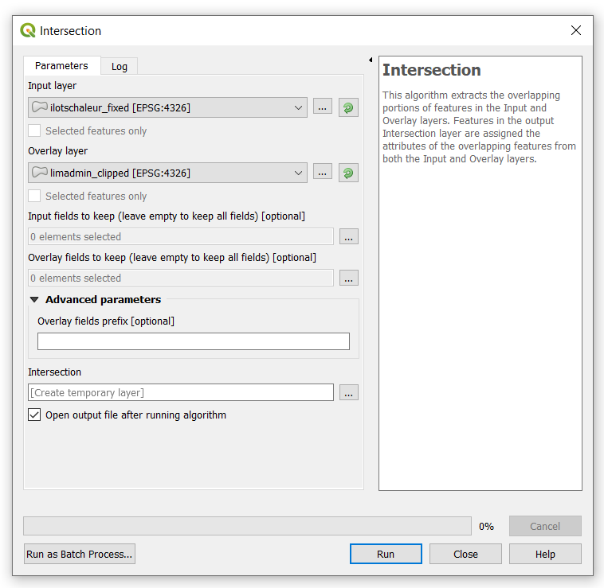
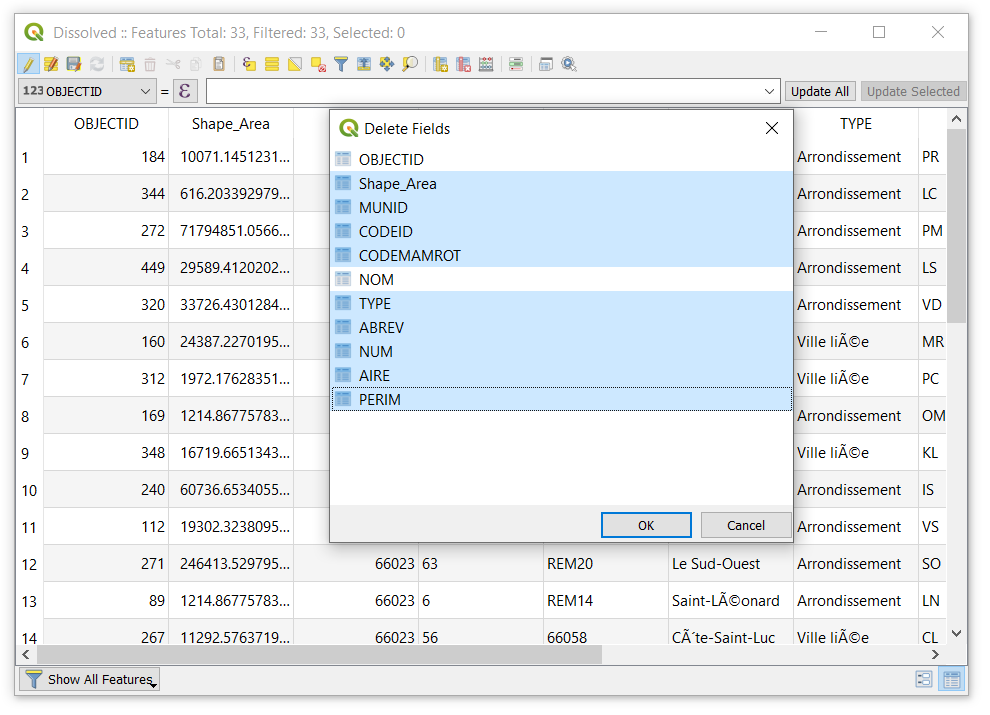
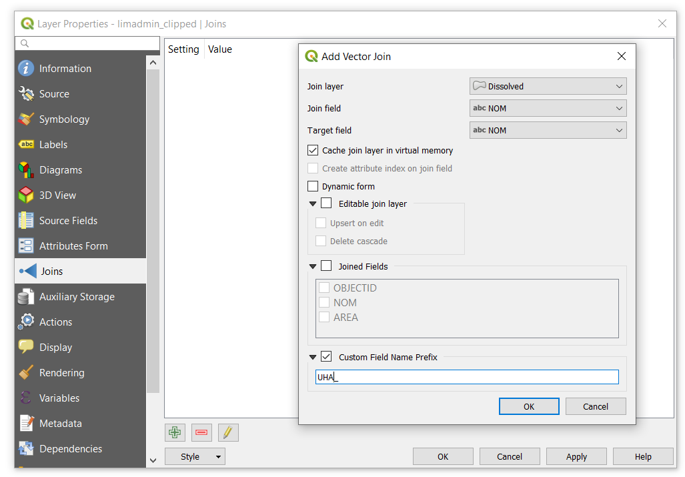

# Exercises
## Exercise 1: Determine the area fraction of urban heat islands by boroughs of Montreal

The aim of this exercise is to generate a [choropleth map](https://en.wikipedia.org/wiki/Choropleth_map) showing the area fraction of urban heat islands by boroughs of Montreal.

```{r echo=FALSE, fig.align='center',fig.cap='Area fraction of UHI by boroughs'}
knitr::include_graphics('figures/Choropleth_UHI.PNG')
```

1. Import `ilotschaleur.json` and `limadmim_clipped.shp`.

```{r echo=FALSE, fig.align='center',fig.cap='UHI and boroughs of Montreal'}
knitr::include_graphics('figures/UHA_Montreal.PNG')
```

2. Export `ilotschaleur.json` as a shapefile and save it as `ilotschaleur.shp` (Section \@ref(saveLayer)).

3. Intersect the recently created layer `ilotschaleur.shp` with `limadmim_clipped.shp`. Navigate to **Vector**, select **Geoprocessing Tools**, and the **Intersection** (Section \@ref(IntersectionVectors)). Set the following parameters:

- **Input layer**: `ilotschaleur.shp`
- **Overlay layer**: `limadmim_clipped.shp`

The aim is to generate a new layer in which the urban heat islands are divided according to Montreal’s boroughs.

```{r echo=FALSE,fig.align='center',fig.cap='Intersection of layers'}
knitr::include_graphics('figures/Intersection_UHA.PNG')
```

Click Run to execute the algorithm. However, it will stop since there are some invalid geometries in the input layer.


```{r echo=FALSE,fig.align='center',fig.cap='Error: Intersection of layers'}
knitr::include_graphics('figures/Intersection_UHA_Error.PNG')
```

4. We will use the **Fix Geometries** algorithm from the **Processing Toolbox** to fix the geometries. Run the algorithm according to the following settings.

```{r echo=FALSE, fig.align='center',fig.cap='Fix geometries algorithm'}
knitr::include_graphics('figures/Fix_Geometry_UHA.PNG')
```

A temporary layer will be generated after running the algorithm. Right click on layer `Fixed geometries` and rename it `ilotschaleur_fixed`. 

5. Run again the **Intersection** algorithm, but this time use the fixed layer of urban heat islands. Set the following parameters:

- **Input layer**: `ilotschaleur_fixed.shp`
- **Overlay layer**: `limadmim_clipped.shp`


```{r echo=FALSE,fig.align='center',fig.cap='Intersection of layers'}

```


A temporary layer `Intersection` will be generated after running the algorithm. To verify that the algorithm has properly worked, open the attribute table and you will notice that the `Intersection` layer has 584 attributes, whereas the `ilotschaleur_fixed` has 498.

6. Dissolve the `Intersection` layer by NOM. The aim is to combine the polygons corresponding to the same borough, which is given by the NOM field. In the **Dissolve field(s)**, click on the … and select NOM.

```{r echo=FALSE, fig.align='center',fig.cap='Dissolve Intersection layer by NOM'}
knitr::include_graphics('figures/Dissolve_UHA.PNG')
```

After running the **Dissolve** algorithm, a temporary layer `Dissolved` will be generated. Open the attribute table of this layer and verify that it has 33 attributes; whereas the `Intersection` layer has 584. The task of combining the polygons has been accomplished.

7. Calculate the area of the urban heat islands by boroughs. 

First of all, we will delete the fields of the `Dissolved` layer that will not be used. Open the attribute table, then click on the pencil shown in the left corner (**Toggle editing mode**) to allow editing the attribute table. Click on **Delete** field and select the fields shown in the following figure:

```{r echo=FALSE, fig.align='center',fig.cap='Delete some fields of Dissolved layer'}

```

We will now calculate the area of the urban heat islands by borough. Click on **New field**. In the window that will display, select **Create a new field**, indicate *AREA* in the **Output field name**, set *Decimal number (real)* as the **Output field type**. Double click on *$area* from the center panel.

```{r echo=FALSE, fig.align='center',fig.cap='Calculate the area of UHI'}
knitr::include_graphics('figures/Calculate_Area.PNG')
```

8. Join the AREA of the urban heat islands (`Dissolved` layer) to the respective borough in the `limadmim_clipped.shp` layer. The prefix **UHA_ was** set to distinguish the fields from the joined layer.


```{r echo=FALSE, fig.align='center', fig.cap='Join layers'}

```

9. Calculate the fraction area of urban heat islands (UHI) by boroughs.

First, calculate the AREA of each borough from the `limadmim_clipped.shp` layer. Click on **New field**. In the window that will display, select **Create a new field**, indicate AREA in the Output field name, set Decimal number (real) as the Output field type. Double click on $area from the center panel.  

```{r echo=FALSE, fig.align='center',fig.cap="Calculate the area of Montreal's boroughs"}
knitr::include_graphics('figures/Calculate_Area_Montreal.PNG')
```

Finally, calculate the area fraction of UHI. In the center panel, go to **Fields and Values**, double click to select the involved fields in the computation of the new one. In this case, the area fraction is given by the expression: FRAC_UHA = UHA_AREA/AREA

> Note: UHI was misspelled. So UHA stand for UHI.


```{r echo=FALSE, fig.align='center',fig.cap='Calculate the area fraction of UHI'}
knitr::include_graphics('figures/Calculate_Area_Fraction.PNG')
```

10. Style the `limadmim_clipped.shp` layer so that it shows the area fraction of UHI in four classes of equal interval.

Right click on `limadmim_clipped.shp`, select **Properties**, then **Symbology**, and set the parameters according to the following figure.


```{r echo=FALSE, fig.align='center',fig.cap='Changing the symbology of a layer'}
knitr::include_graphics('figures/Area_Fraction_UHA.PNG')
```


