--- 
title: "A brief introduction to QGIS"
author: "Ivan Viveros Santos"
date: "`r Sys.Date()`"
site: bookdown::bookdown_site
output: bookdown::gitbook
documentclass: book
bibliography: [book.bib, packages.bib]
biblio-style: apalike
link-citations: yes
github-repo: rstudio/bookdown-demo
description: "This is a a brief introduction to QGIS."
---

# Introduction

[QGIS](https://qgis.org/en/site/) is an Open Source Geographic Information System (GIS) licensed under the GNU General Public License.

The aim of this document is to present some recipes about importing and exporting vectors, and treatment and exploration of spatial data. I plan to add more recipes on vector styling and map composition. 

This is a brief introduction to QGIS, as such, it does not replace in any maner the [QGIS User Guide](https://docs.qgis.org/3.4/en/docs/user_manual/). I also recommend you visiting the [StackExchange](https://gis.stackexchange.com/) chanel, where you can get support on questions related to QGIS.

The data used to illustrate the recipes presented in this document come from the [Portail données ouvertes Montréal](http://donnees.ville.montreal.qc.ca/); particularly, the selected data from this site is under the license [Creative Commons Attribution 4.0 International](https://creativecommons.org/licenses/by/4.0/).

To follow the recipes presented in this document, please download the accompanying files from my [GitHub page](https://github.com/iviveros/QGIS_Data).

<!--chapter:end:index.Rmd-->

# QGIS installation and Graphical User Interface {#installation}

## QGIS installation

It is possible to install QGIS on Windows, Mac OS X, Linux, BSD, and Android operating systems. The installers can be downloaded from [this website](https://qgis.org/en/site/forusers/download.html), and [this link](https://qgis.org/en/site/forusers/alldownloads.html#) provides detailed installation instructions.

By the time of writing this document, the last version of QGIS is `3.8.2 Zanzibar`, which was released on October 16, 2019.

## QGIS Graphical User Interface

The QGIS graphical user interface (GUI) is composed of: 

- **Menu bar**: gives access to the main functionalities of QGIS.
- **Toolbars**: give a quick access to QGIS functionalities.
- **Panels**: they provide several functionalities, for instance managing layers, and browsing spatial data.
- **Map display**: shows the spatial data of the current project.

```{r echo=FALSE, fig.align='center',fig.cap='QGIS GUI'}
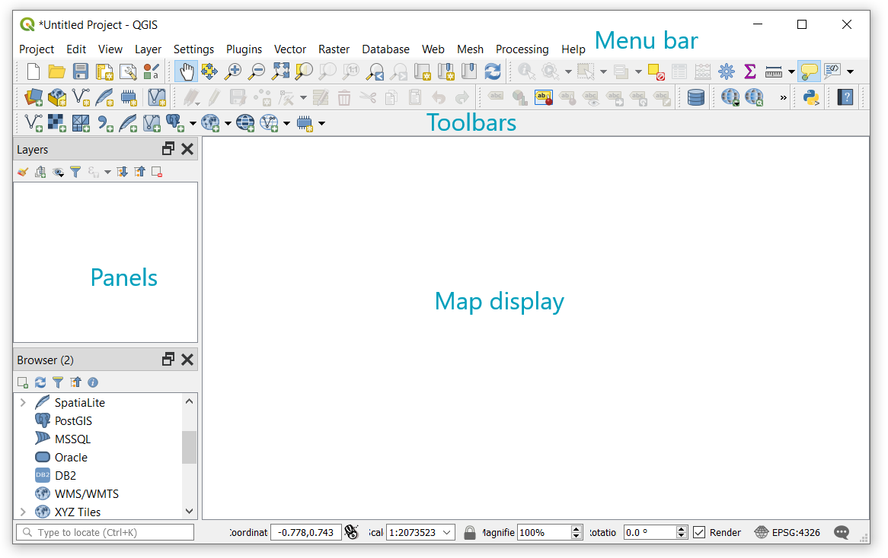
```

It is possible to customize the appearance of QGIS by navigating to **View** from the **Menu bar**. From here, you can select the panels and toolbars you want to display. I would recommend toggling the **Processing Toolbox** from the panel because it allows to quickly access to the main operations available in QGIS.


<!--chapter:end:01-intro.Rmd-->

# Loading and Exporting data

The quickest way to load data into QGIS is the technique drag-and-drop. It only requires locating the data you want to import into QGIS, select the file, and drop it on the **Map display** or on the **layer panel**. 

Another option for importing data is to use the browser panel. Navigate through the browser, locate the layer or data to be imported, right-click on it, and finally select Add Layer to Project. However, using the **Manage Layers Toolbar** or **Add Layer** from the **Layer** menu give more control on the importation.

## Importing data from text files

This recipe is illustrated with the `coordonnees-stations-rsqa.csv` file, which reports the locations of the stations of the Air Quality Monitoring Network (RSQA) set up in Montreal. The aim of the [RSQA](https://ville.montreal.qc.ca/rapportmontrealdurable/en/air-quality.php) is to monitor the atmospheric concentration of [criteria pollutants](https://www.epa.gov/criteria-air-pollutants).

1. Navigate to the **Layer** menu and select **Add delimited text layer**. The following dialog will pop up:

```{r echo=FALSE, fig.align='center',fig.cap='Add delimited text layer window'}
knitr::include_graphics('figures/Delimited_Text_Dialog.png')
```

2. In the **File Name** field, indicate the path to the `coordonnees-stations-rsqa.csv` file.

```{r echo=FALSE,fig.align='center',fig.cap='Indicating the path to the text file'}
knitr::include_graphics('figures/Delimited_Text_Dialog_2.png')
```

3. In the **Geometry Definition** section, indicate that point coordinates are being imported. Then indicate the corresponding fields for longitude and latitude. According to the sources of the layer being imported, the coordinate system is WGS 84, so we don’t need to change it. When you want to import an attribute table, you can select the option **No geometry**.

4. Click on **Add**. You will see the following set of points, probably not in the same colour. Optionally, you can add a base map or another layer to give some spatial context, but for now we have successfully imported the layer corresponding to the stations of the RSQA network.

```{r echo=FALSE,fig.align='center',fig.cap="Montreal's Air Quality Monitoring Network"}
knitr::include_graphics('figures/Stations_RSQA.png')
```

> In section \@ref(basemaps) we describe how to add a basemap to add spatial context.

5. **Optional step**: save the imported layer as a new shapefile (Section \@ref(saveLayer)).


## Importing data from KML files

QGIS supports importing [Keyhole Markup Language](https://developers.google.com/kml/) (KML) files. KML is the format used by Google Earth to show spatial data.

The importation of a KML is illustrated with the `grandparcs.kml` file which contains polygons corresponding to the [parks of Montreal](http://donnees.ville.montreal.qc.ca/dataset/grands-parcs). 

1.	Navigate to the **Layer** menu and select **Add vector layer**. The following dialog will pop up:

```{r echo=FALSE, fig.align='center',fig.cap='Add vector layer window'}
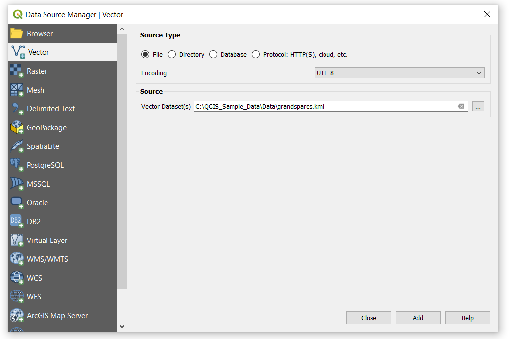
```

2.	In the **File Name** field, indicate the path to the `grandparcs.kml` file. The following layer will be displayed in QGIS:

```{r echo=FALSE,fig.align='center',fig.cap="Montreal's parks"}
knitr::include_graphics('figures/Import_KML_2.png')
```


##Importing GeoJSON files

[GeoJSON](https://geojson.org/) is another frequently used format for storing and representing geographical attributes. This format is based on the JavaScript Object Notation (JSON). 

The importation of a GeoJSON layer is illustrated with the `ilotschaleur.json` file. This file contains the [urban heat islands (UHI) of Montreal](http://donnees.ville.montreal.qc.ca/dataset/schema-environnement-milieux-naturels/resource/8cd8d34a-cfdd-4acf-a363-d4adaeff18c0). UHI correspond to urban areas characterized by higher summer temperatures than the immediate environment with differences between 5 and 10°C.

1. Navigate to the **Layer** menu and select **Add vector layer**. The following dialog will pop up:

```{r echo=FALSE,fig.align='center',fig.cap='Add vector layer window'}
knitr::include_graphics('figures/Import_geojson.png')
```

2. In the **File Name** field, indicate the path to the `ilotschaleur.json` file. The following layer will be displayed in QGIS:

```{r echo=FALSE, fig.align='center',fig.cap='Urban heat islands (UHI) of Montreal'}
knitr::include_graphics('figures/Import_geojson_2.png')
```


## Saving a layer {#saveLayer}

We use the previously imported `coordonnees-stations-rsqa.csv` file to illustrate how to export a layer in a different format.

1. Right-click on the name of the layer, select **Export**, then **Save features As…** The following dialog window will pop up.

```{r echo=FALSE,fig.align='center',fig.cap='Save features as... window'}
knitr::include_graphics('figures/Save_Layer.png')
```

2. Select the format in which you want to export the layer. In this case, we have selected the widely used ESRI shapefile, we will use this layer in future recipes. Another commonly used format is GeoJson since it is compatible with web base applications.

3. Indicate the path where the layer will be stored and give it a name. Indicate whether you want to add the saved file to the current project, and finally click on OK.

## Reprojecting a layer

Most of the time, the layers are not in a CRS that is more convenient for the operation in hand. QGIS offers on-the-fly reprojections for rendering the layers. However, when executing operations like spatial analysis, it is required that all layers be in the same CRS. This recipe is illustrated with the `LIMADMIN.shp` file that corresponds to the administrative limits of Montreal’s boroughs.

Before executing a spatial analysis, it is recommended to reproject the layers to the most convenient CRS. 

1. Right-click on the name of the layer, select **Export**, then **Save features As…**. The following dialog window will pop up.
2. Indicate the path where the layer will be stored and give it a name. If you tick the box **Add saved file to map**, the recently exported layer will be saved and added to the current project.

```{r echo=FALSE,fig.align='center',fig.cap='Reprojecting a layer'}
knitr::include_graphics('figures/Reproject_Layer.png')
```

3. Click on the little globe to select the CRS in which the new layer will be projected. The following window will pop up:

```{r, echo=FALSE, fig.align='center',fig.cap='Selecting another CRS'}
knitr::include_graphics('figures/Reproject_Layer_CRS.png')
```

4. You can filter the CRS. In this case we will export the new layer in **EPSG:6622**, since it is the most accurate for [Quebec](https://epsg.io/6622). Click **OK** to confirm the selection of the CRS and click again **OK** to save the layer.


<!--chapter:end:02-import_export.Rmd-->

# Data treatment

##Joining a layer data

Another frequent task before executing spatial analysis with QGIS is to join an attribute table to a layer.

To illustrate this task, we refer to the `stations_rsqa.shp` file generated in section 1 and the file `pollutants_average_12_31_2019_13H.csv` file. When we load the shapefile into QGIS we identify that this layer only contains information on the identification and location of stations that compose the Air Quality Monitoring Network (RSQA).

```{r echo=FALSE, fig.align='center',fig.cap='Attribute table of stations_rsqa layer'}
knitr::include_graphics('figures/Change_Encoding.png')
```

We realize another problem, the name (nom) and the address of the stations are not correctly displayed. In order to fix it, right-click on the name of the layer, and select properties. A window will pop up. Go to **Source** and change the **Data Source Encoding** to **UTF-8**. Finally, click on Apply to accept the changes.


```{r echo=FALSE, fig.align='center',fig.cap='Changing encoding'}
knitr::include_graphics('figures/Change_Encoding_2.png')
```

Now, import the `pollutants_average_12_31_2019_13H.csv` file. One kick method is to drag and drop the file from the file into QGIS. This works fine for this file; however, you also can use **Add Delimited Text Layer** to have more control on the importation.

The `pollutants_average_12_31_2019_13H.csv` file reports the average concentration of criteria pollutants from December 23, 2013, at 12h. The units of concentration are indicated in the following table.

Pollutant | Unit 
--------- |----- 
CO        |ppm   
H<sub>2</sub>S | ppb 
NO |ppb
NO<sub>2</sub> | ppb
SO<sub>2</sub> | $\mu g/m^3$
PM<sub>10</sub> | $\mu g/m^3$
PM<sub>2.5</sub> | $\mu g/m^3$
O<sub>3</sub> | ppb

In order to join the `pollutants_average_12_31_2019_13H` attribute table to the `stations_rsqa` layer, follow these steps:

1. Right-click on the name of `stations_rsqa` layer, select **Properties**, then **Joins** from the dialog window.

```{r echo=FALSE, fig.align='center',fig.cap='Layer properties window'}
knitr::include_graphics('figures/Joins_Dialog_Box.png')
```

2. Click on the green **+** sign. The following window will pop up:

```{r echo=FALSE,fig.align='center',fig.cap='Joining a layer table'}
knitr::include_graphics('figures/Joins_Dialog_Box_2.png')
```

In this case, since we have imported only one attribute table, QGIS has already selected the Join layer. 

3. Specify the **Join field** and the **Target field**, which correspond to the keys that relate the shapefile layer and the data layer. In this example, **NO_POSTE** is the identifier of the stations in the data layer and **Numéro st** is the identifier of the stations in the shapefile layer. Furthermore, it is possible to select the fields that will be joined, and the prefix that will be used. Since there are no repeated columns, we just deleted the default prefix, which corresponds to the name of the layer.

4. Click on **OK**, then on **Apply** to finish the joining.

> To verify if the join has worked, you can open the attribute table of the shapefile. To make this change permanent, you need to export the layer. After the join, the layer was exported as `stations_rsqa_12_31_2013.shp`.

## Cleaning up the attribute table

Sometimes, data imported into QGIS is not in the correct format, the name of columns is not self-explanatory, or we simply want to discard the columns that will not be used during the task in hand.

The **Refactor fields** algorithm simplifies removing, renaming and converting the format of dbf tables in QGIS. This algorithm ca be accessed through the **Processing Toolbox**. The use of **Refactor fields** is illustrated with the `stations_rsqa_12_31_2013.shp` file that was generated in the previous section. 

1. Import `stations_rsqa_12_31_2013.shp` file
2. Launch the **Refactor field**. It will detect the available layer in the current project. In this window we can identify the name of columns, the type of information they store, their length and precision. The columns corresponding to concentrations, such as CO, H<sub>2</sub>S, and NO, are currently stored as text (data type is string). This is not convenient, since we cannot do arithmetic with text. Furthermore, we may want to change the name of **Numéro st** field for **Station**.

```{r echo=FALSE, fig.align='center',fig.cap='Refactor field window'}
knitr::include_graphics('figures/Refactor_Dialog.png')
```

3. We change the name of the first three columns according to the following figure, and the type of columns corresponding to concentrations was set as **Double** (real number) with a length of 23 and a precision of 3. Click on **Run** to generate a new layer.

```{r echo=FALSE,fig.align='center',fig.cap='Using the refactor field algorithm'}
knitr::include_graphics('figures/Refactor_Dialog_Settings.png')
```

4. The generated layer is named by default Refactored, of course, you can change its name at your convenience. 

```{r echo=FALSE,fig.align='center',fig.cap='Saving the refactored layer'}
knitr::include_graphics('figures/Refactor_Dialog_Settings_2.png')
```


<!--chapter:end:03-data_treatment.Rmd-->

# Data preprocessing steps

## Clipping vectors

In some cases, it is necessary than a layer covers only an area of interest. For this purpose, we can use a layer setting the extent we want to keep for a section of a layer. To accomplish this task, we use **Clip** from the **Geoprocessing Tool**. 

To illustrate the operation of clipping vectors, we will use `terre_shp` and `LIMADMIN.shp` files.

1. Load both layers into QGIS. `LIMADMIN.shp` corresponds to the administrative limits of Montreal’s boroughs (last update in 2013); however, the polygons extent beyond the terrestrial limits; whereas the `terre_shp` file corresponds to the terrestrial limits of Montreal Island.

```{r echo=FALSE,fig.align='center',fig.cap='Montreal’s boroughs'}
knitr::include_graphics('figures/Clipping_Vectors.png')
```

2. Navigate to **Layer**, then to **Geoprocessing Tool**, and select **Clip**. The following window will pop up. `LIMADMIN.shp` layer corresponds to the Input layer, since it is the layer we want to cut, whereas the `quartier_limite.shp` is the Overlay layer, the layer we will use to set the limits we want to keep. 

```{r echo=FALSE,fig.align='center',fig.cap='Using the clip algorithm'}
knitr::include_graphics('figures/Clipping_Vectors_Dialog.png')
```

4. Click on Run to generate a new layer. Save the clipped layer as `limadmin_clipped.shp`.

## Intersecting vectors {#IntersectionVectors}

The **Intersection** algorithm extracts the properties from the input layer that overlap features in the overlay layer.

To illustrate this recipe, consider the `terre.shp` and `LIMADMIN.shp` files. In this case, we will create a layer resulting from the intersection between `terre.shp` and `LIMADMIN.shp`. Therefore, the `terre.shp` layer corresponds to the **Input Layer**, whereas `LIMADMIN.shp` to the **Overlay Layer**. We can add an overlay index to identify the features that were intersected from the overlay layer in Intersection layer generated

```{r echo=FALSE, fig.align='center',fig.cap='Intersection of vectors'}
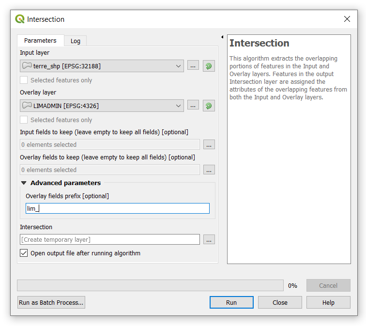
```

## Check validity and fix geometries

In some cases, when clipping and intersecting vectors, errors may arise because of invalid geometries. Fortunately, QGIS allows us to check the validity of layers, and even more importantly to fix them. The following algorithms can be accessed through the **Processing Toolbox**:

- **Check validity**: The algorithm performs a validity check on the geometries of a vector layer. The geometries are classified in three groups (valid, invalid and error).
- **Fix geometries**: The algorithm attempts to create a valid representation of an invalid geometry without losing any of the input vertices.

```{r echo=FALSE, fig.align='center',fig.cap='Check validity and fix geometries'}
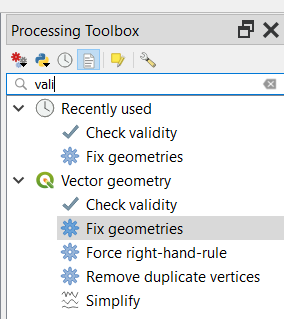
```


<!--chapter:end:04-data_processing.Rmd-->

# Data exploration

##Listing unique values in a column

The **List Unique values** algorithm, from the **Processing Toolbox**, generates a table and a HTLM report of the unique values of a given layer's field. 

To illustrate the use of the **List Unique values** algorithm, we will import the `grandparcs.kml` file. The field **Generique2** stores the type of parks located in Montreal, and we would like to know the unique values without having to open the attribute table.

1. Launch the **List Unique values** algorithm from the **Processing Toolbox**. It will identify the available layer in the current project.

2. Click on **…** from the **Target Field(s)** and select **Generique2**. Click on Run to generate a temporary layer and a HTLM report.

```{r echo=FALSE,fig.align='center',fig.cap='List unique values window'}
knitr::include_graphics('figures/List_Unique_Values.png')
```

## Loading BaseMaps {#basemaps}

When we import layers into QGIS, sometimes it is difficult to identify what the points, lines or polygons of a layer correspond to. In these situations, it is very helpful to add a base map to give some spatial context.

One plugging that comes in hand to add spatial context is **QuickMapServices**. If it is not already available in your QGIS Desktop, navigate to **Plugins**, then to **Manage and Install Plugins**. In the window that has been displayed search **QuickMapServices** and click on **Install Plugin**.

```{r echo=FALSE,fig.align='center',fig.cap='Manage and install plugins in QGIS'}
knitr::include_graphics('figures/QuickMapServices.png')
```

To illustrate the use of **QuickMapServices**, load the `stations_rsqa_12_31_2013.shp`. Navigate to **Web** from the menu bar, select **QuickMapServices**, go to **OSM**, and select **OSM_Standard**. You will see the following set of air quality monitoring stations located in Montreal.

```{r echo=FALSE, fig.align='center',fig.cap="Montreal's Air Quality Monitoring Network"}
knitr::include_graphics('figures/BaseMaps_Example.png')
```


<!--chapter:end:05-data_exploration.Rmd-->

# Exercises
## Exercise 1: Determine the area fraction of urban heat islands by boroughs of Montreal

The aim of this exercise is to generate a [choropleth map](https://en.wikipedia.org/wiki/Choropleth_map) showing the area fraction of urban heat islands by boroughs of Montreal.

```{r echo=FALSE, fig.align='center',fig.cap='Area fraction of UHI by boroughs'}
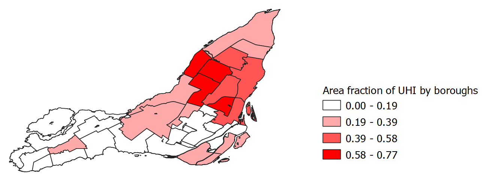
```

1. Import `ilotschaleur.json` and `limadmim_clipped.shp`.

```{r echo=FALSE, fig.align='center',fig.cap='UHI and boroughs of Montreal'}
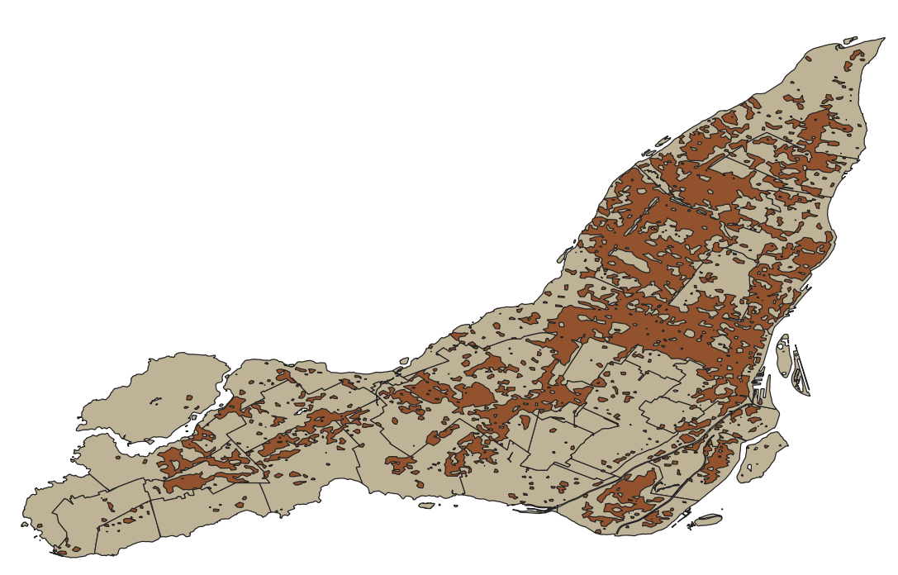
```

2. Export `ilotschaleur.json` as a shapefile and save it as `ilotschaleur.shp` (Section \@ref(saveLayer)).

3. Intersect the recently created layer `ilotschaleur.shp` with `limadmim_clipped.shp`. Navigate to **Vector**, select **Geoprocessing Tools**, and the **Intersection** (Section \@ref(IntersectionVectors)). Set the following parameters:

- **Input layer**: `ilotschaleur.shp`
- **Overlay layer**: `limadmim_clipped.shp`

The aim is to generate a new layer in which the urban heat islands are divided according to Montreal’s boroughs.

```{r echo=FALSE,fig.align='center',fig.cap='Intersection of layers'}
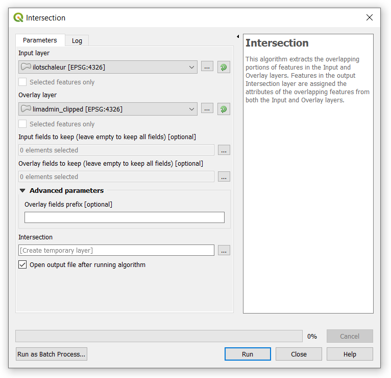
```

Click Run to execute the algorithm. However, it will stop since there are some invalid geometries in the input layer.


```{r echo=FALSE,fig.align='center',fig.cap='Error: Intersection of layers'}
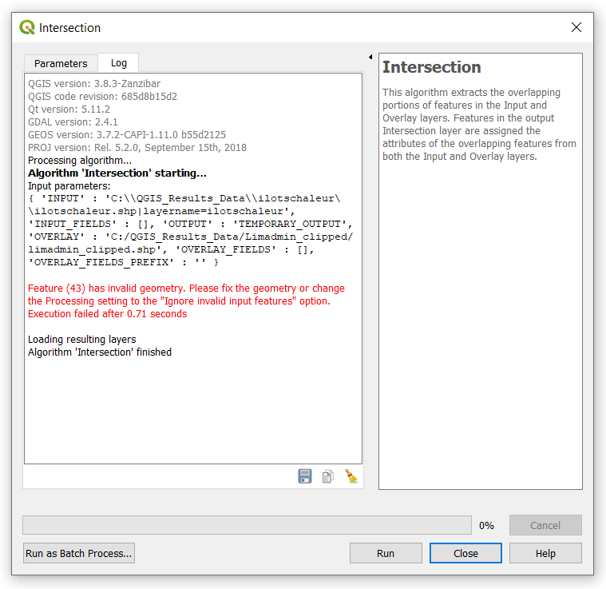
```

4. We will use the **Fix Geometries** algorithm from the **Processing Toolbox** to fix the geometries. Run the algorithm according to the following settings.

```{r echo=FALSE, fig.align='center',fig.cap='Fix geometries algorithm'}
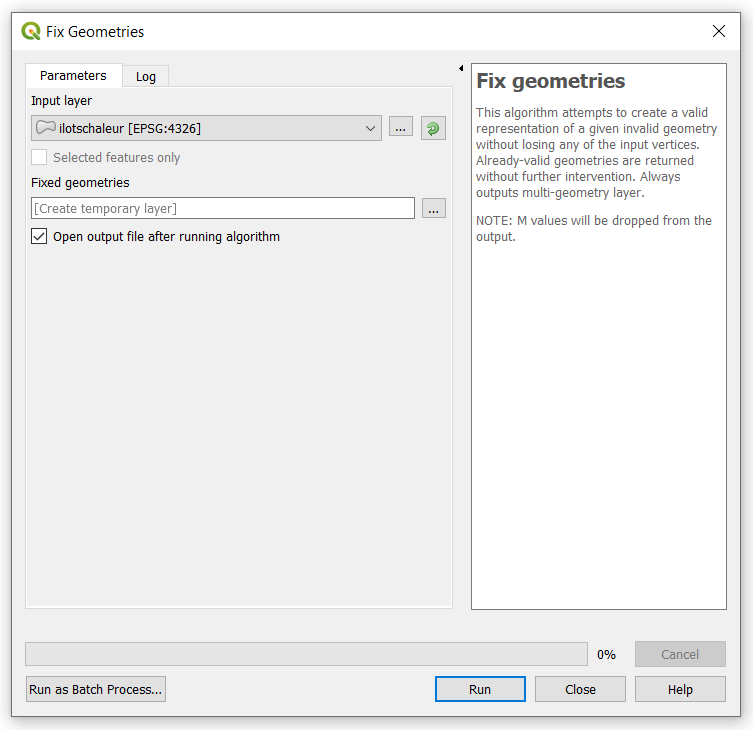
```

A temporary layer will be generated after running the algorithm. Right click on layer `Fixed geometries` and rename it `ilotschaleur_fixed`. 

5. Run again the **Intersection** algorithm, but this time use the fixed layer of urban heat islands. Set the following parameters:

- **Input layer**: `ilotschaleur_fixed.shp`
- **Overlay layer**: `limadmim_clipped.shp`


```{r echo=FALSE,fig.align='center',fig.cap='Intersection of layers'}
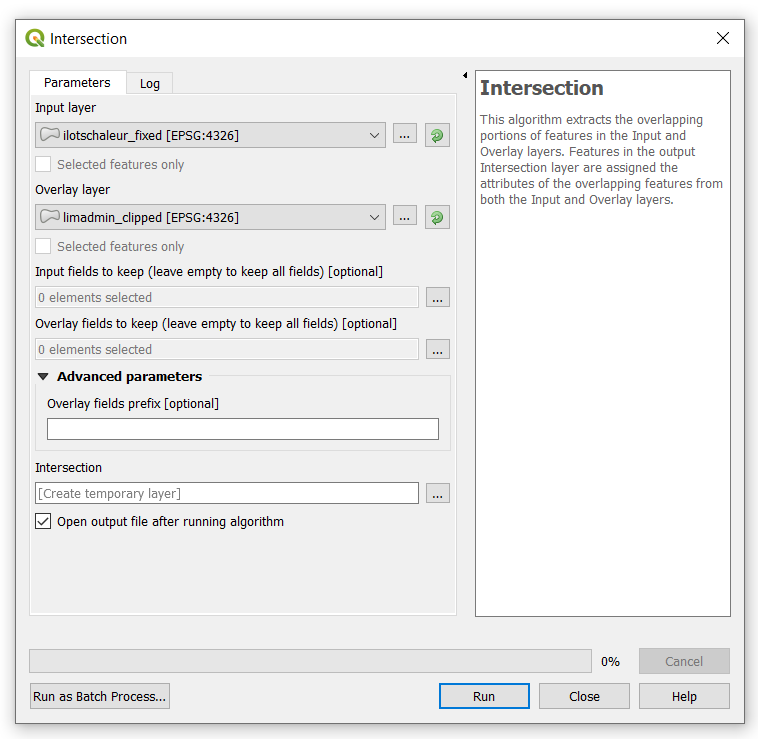
```


A temporary layer `Intersection` will be generated after running the algorithm. To verify that the algorithm has properly worked, open the attribute table and you will notice that the `Intersection` layer has 584 attributes, whereas the `ilotschaleur_fixed` has 498.

6. Dissolve the `Intersection` layer by NOM. The aim is to combine the polygons corresponding to the same borough, which is given by the NOM field. In the **Dissolve field(s)**, click on the … and select NOM.

```{r echo=FALSE, fig.align='center',fig.cap='Dissolve Intersection layer by NOM'}
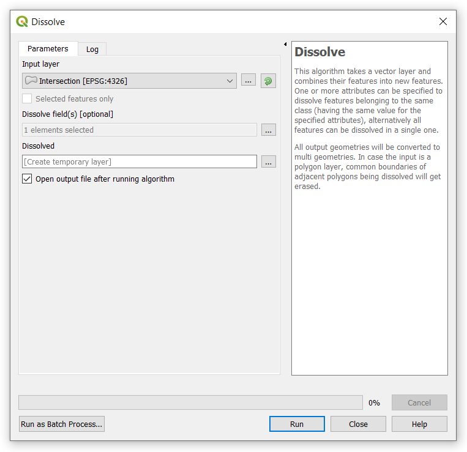
```

After running the **Dissolve** algorithm, a temporary layer `Dissolved` will be generated. Open the attribute table of this layer and verify that it has 33 attributes; whereas the `Intersection` layer has 584. The task of combining the polygons has been accomplished.

7. Calculate the area of the urban heat islands by boroughs. 

First of all, we will delete the fields of the `Dissolved` layer that will not be used. Open the attribute table, then click on the pencil shown in the left corner (**Toggle editing mode**) to allow editing the attribute table. Click on **Delete** field and select the fields shown in the following figure:

```{r echo=FALSE, fig.align='center',fig.cap='Delete some fields of Dissolved layer'}
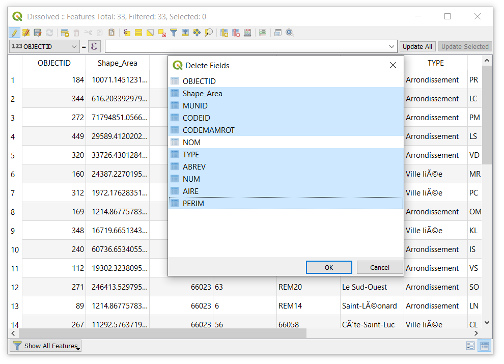
```

We will now calculate the area of the urban heat islands by borough. Click on **New field**. In the window that will display, select **Create a new field**, indicate *AREA* in the **Output field name**, set *Decimal number (real)* as the **Output field type**. Double click on *$area* from the center panel.

```{r echo=FALSE, fig.align='center',fig.cap='Calculate the area of UHI'}
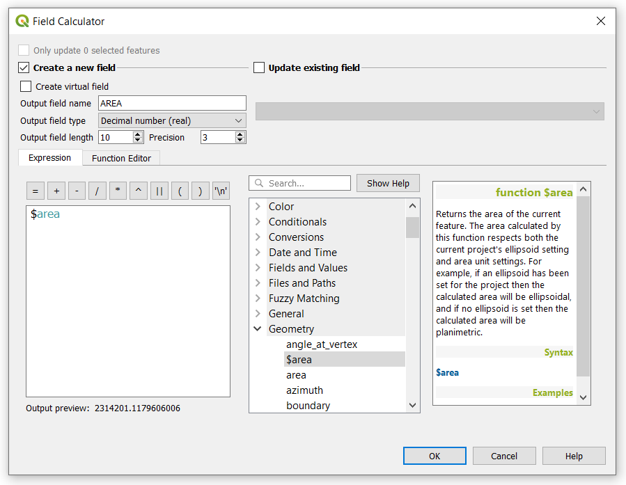
```

8. Join the AREA of the urban heat islands (`Dissolved` layer) to the respective borough in the `limadmim_clipped.shp` layer. The prefix **UHA_ was** set to distinguish the fields from the joined layer.


```{r echo=FALSE, fig.align='center', fig.cap='Join layer Dissolved to limadmim_clipped'}
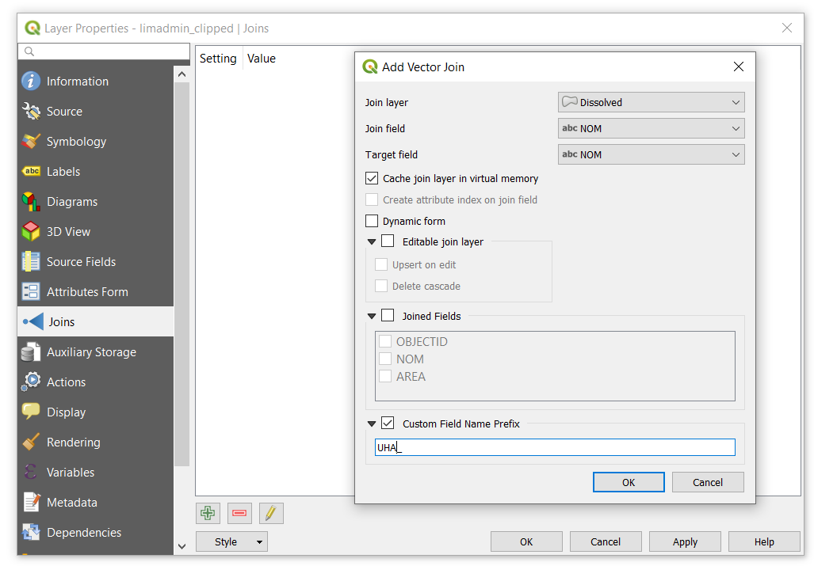
```

9. Calculate the fraction area of urban heat islands (UHI) by boroughs.

First, calculate the AREA of each borough from the `limadmim_clipped.shp` layer. Click on **New field**. In the window that will display, select **Create a new field**, indicate AREA in the Output field name, set Decimal number (real) as the Output field type. Double click on $area from the center panel.  

```{r echo=FALSE, fig.align='center',fig.cap="Calculate the area of Montreal's boroughs"}
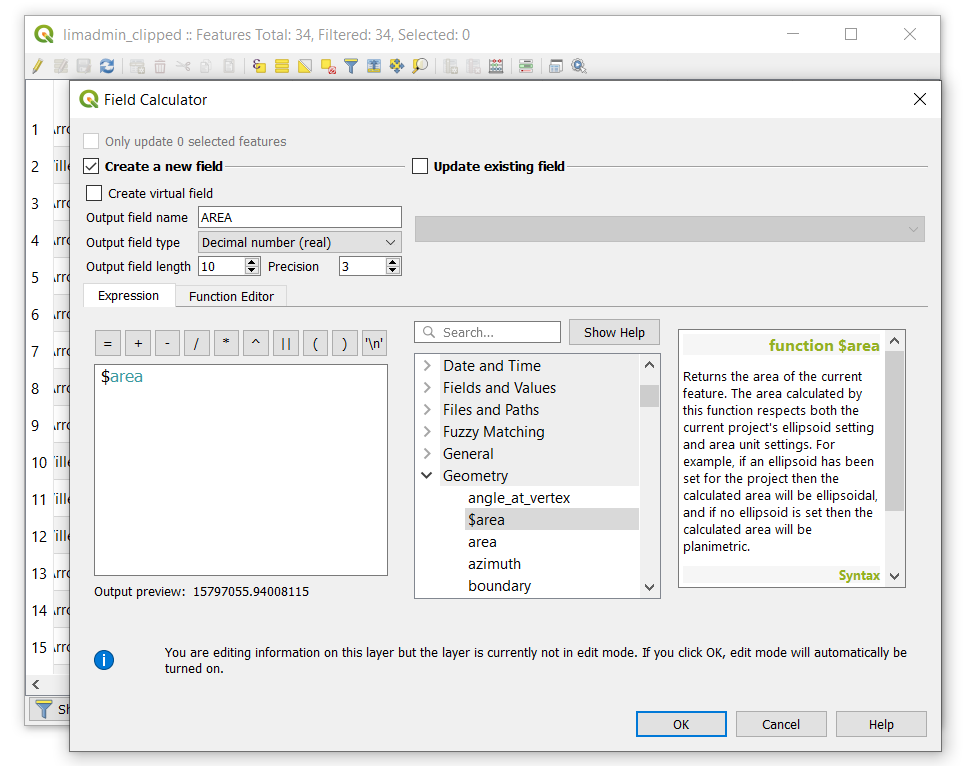
```

Finally, calculate the area fraction of UHI. In the center panel, go to **Fields and Values**, double click to select the involved fields in the computation of the new one. In this case, the area fraction is given by the expression: FRAC_UHA = UHA_AREA/AREA

> Note: UHI was misspelled. So UHA stand for UHI.


```{r echo=FALSE, fig.align='center',fig.cap='Calculate the area fraction of UHI'}
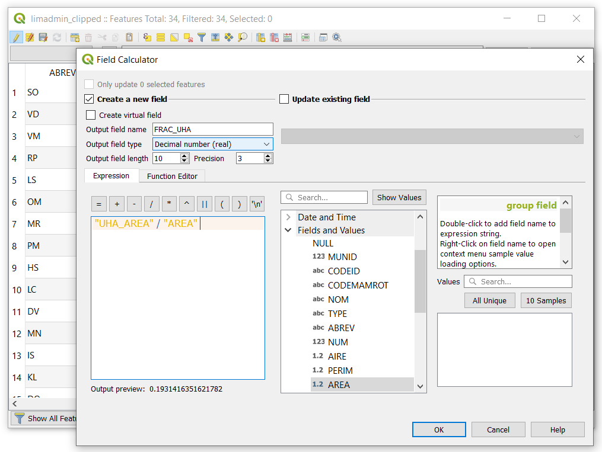
```

10. Style the `limadmim_clipped.shp` layer so that it shows the area fraction of UHI in four classes of equal interval.

Right click on `limadmim_clipped.shp`, select **Properties**, then **Symbology**, and set the parameters according to the following figure.


```{r echo=FALSE, fig.align='center',fig.cap='Changing the symbology of a layer'}
knitr::include_graphics('figures/Area_Fraction_UHA.PNG')
```


<!--chapter:end:06-exercices.Rmd-->

# References


Data |	File name |	Source
-----|------------|-------
RSQA - liste des stations |	coordonnees-stations-rsqa.csv	| [Portail données ouvertes Montréal](http://donnees.ville.montreal.qc.ca/dataset/rsqa-liste-des-stations/resource/29db5545-89a4-4e4a-9e95-05aa6dc2fd80)
RSQA - polluants gazeux 2013-07-01 à 2013-12-31 |	pollutants_average_12_31_2019_13H.csv |	[Portail données ouvertes Montréal](http://donnees.ville.montreal.qc.ca/dataset/rsqa-polluants-gazeux/resource/26ddbd0b-47f6-4039-98b2-b32568ed01b1)
Grands parcs	| grandparcs.kml | [Portail données ouvertes Montréal](http://donnees.ville.montreal.qc.ca/dataset/grands-parcs)
Îlots de chaleur | ilotschaleur.json | [Portail données ouvertes Montréal](http://donnees.ville.montreal.qc.ca/dataset/schema-environnement-milieux-naturels/resource/8cd8d34a-cfdd-4acf-a363-d4adaeff18c0)
Limite administrative de l'agglomération de Montréal (Arrondissement et Ville liée) |	LIMADMIN.shp | [Portail données ouvertes Montréal](http://donnees.ville.montreal.qc.ca/dataset/polygones-arrondissements)
Anciens territoires administratifs de l’île de Montréal	| quartier_limite.shp | [Portail données ouvertes Montréal](http://donnees.ville.montreal.qc.ca/dataset/anciens-territoires)


<!--chapter:end:07-references.Rmd-->

